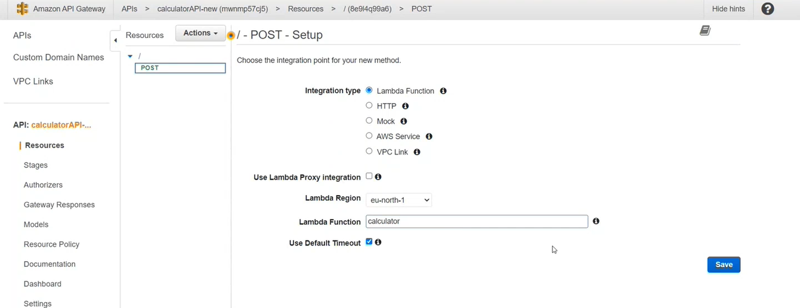

# Cloud-integrated Engineering Calculator

This project is a fully functional Engineering Calculator that performs both arithmetic and scientific calculations. The frontend is built using HTML, CSS, and JavaScript, while the backend leverages AWS services for computation and data storage. The website is hosted on Vercel for seamless accessibility.

## Amazon Web Services Used

* AWS API Gateway: Routes HTTP requests to the Lambda function.
* AWS Lambda: Executes serverless code for arithmetic and scientific calculations.
* AWS DynamoDB: A NoSQL database used to store and retrieve calculation results.
* AWS IAM: Manages permissions and access control across AWS services.
* Vercel: Hosting

## Project Workflow

* Frontend: Users input numbers and select operations via the web interface.
* API Gateway: HTTP requests from the frontend are routed to the Lambda function.
* Lambda Function: Performs the requested calculations (e.g., addition, subtraction, logarithms, permutations, etc.).
* DynamoDB: Stores calculation results for future retrieval.
* IAM: Ensures secure and controlled access to AWS resources.

## Deployment
Vercel hosting link: https://cloud-1esbdghlq-riyan1806.vercel.app/

## Steps
* Step 1: The frontend code was deployed using Vercel for building and hosting the webpage. Vercel provides a fast and reliable platform for hosting static websites.
* Step 2: Created a new Lambda function using the Python 3.9 runtime.
* Step 3: Replaced the default code with custom logic to perform calculations (e.g., addition, subtraction, logarithms, permutations, etc.). Used the math library in Python for advanced calculations. Tested the function using configured test events to ensure accurate results.
* Step 4: Created a REST API and configured a POST method to invoke the Lambda function. Enabled CORS (Cross-Origin Resource Sharing) to allow frontend communication. Deployed the API to a dev stage and obtained the invoke URL.
* Step 5: AWS DynamoDB was used to store and retrieve calculation results. Created a new table with a partition key to store calculation results. Copied the table’s ARN (Amazon Resource Name) for use in IAM policies. AWS IAM was used to grant the Lambda function permissions to access DynamoDB.
* Step 6: Created an inline policy to allow PutItem, GetItem, Scan, and other DynamoDB actions. Attached the policy to the Lambda function’s execution role.
* Step 7: Updated the Lambda function code to write calculation results to DynamoDB. Verified that results were successfully stored in the DynamoDB table.

## Screenshots

### Frontend Interface

### Lambda function

### Configure Test Event

### Create Rest API

### Create POST method

### Enable CORS (Cross-Origin Resource Sharing)

### Deploy API

### DynamoDB

### IAM (Identity and Access Management)

### Explore Table Items

### Result implementation using mutilication operator

